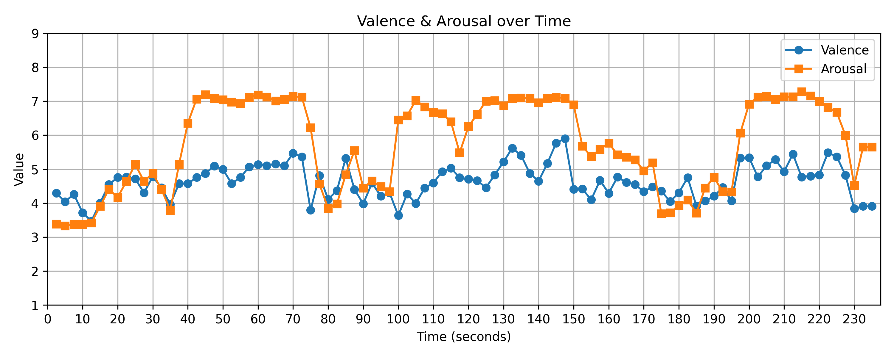

# Audio Emotion Trajectory 
## Introduction
<p align="center">
  
</p>  

This repository provides a simple pipeline for estimating valence and arousal (VA) from music audio and visualizing their temporal dynamics. It uses BEATs-based feature extraction with a lightweight regression head, performing inference with a 2.5-second resolution (5-second window and 2.5-second stride).

- Please see the slide for some examples: [Google Slide](https://docs.google.com/presentation/d/1ElAMaJPgzPhErOd-3w3PMnixizS2TKFIW3IBR_p5FjM/edit?usp=sharing)

## Quick Start Guide
### Installation
Download BEATs feature extractor [pretraind weight](https://www.kaggle.com/datasets/hubfor/microsoft-beats-model) and place in the [model_state](./model_state/) folder.
This repo is debveloped using python version 3.8
```bash
git clone https://github.com/DCN2001/VA-SEQ.git
cd VA-SEQ
pip install -r requirements.txt
```
* Our code is built on pytorch version 2.4.1 (torch==2.4.1 in the requirements.txt). But you might need to choose the correct version of `torch` based on your CUDA version


### Inference
```bash
python infer_5s.py --audio_path PATH_TO_AUDIO_FILE --output_path PATH_TO_SAVE_RESULT
```