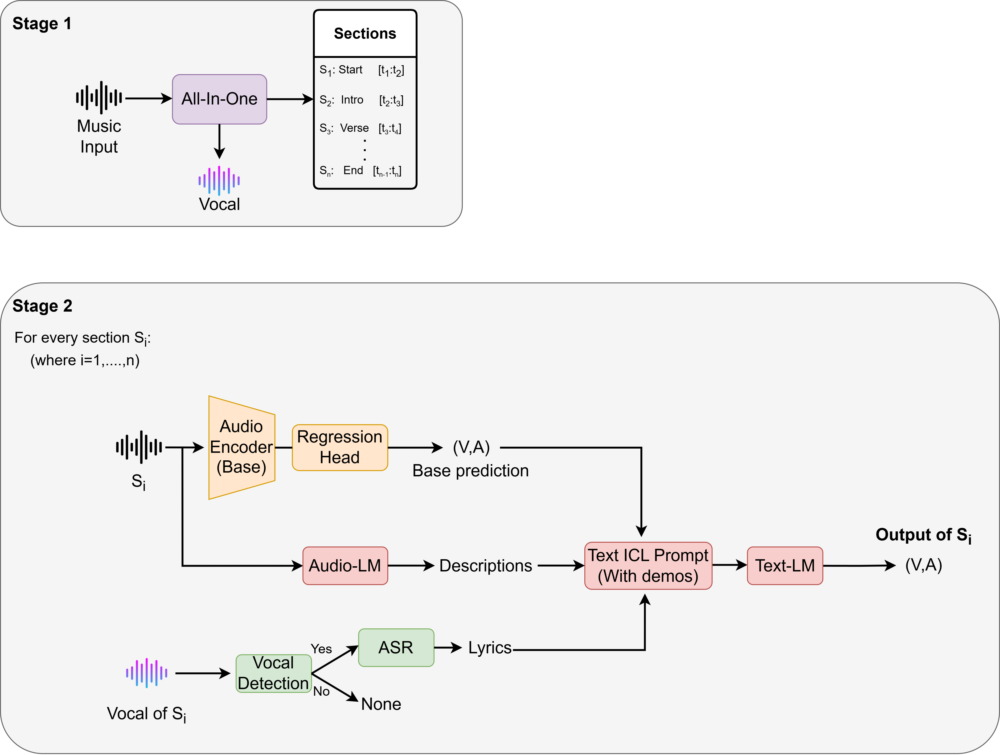
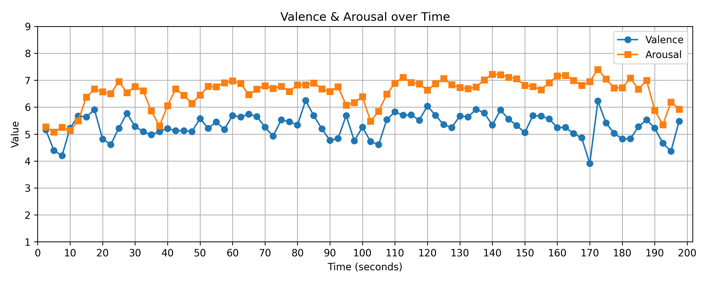
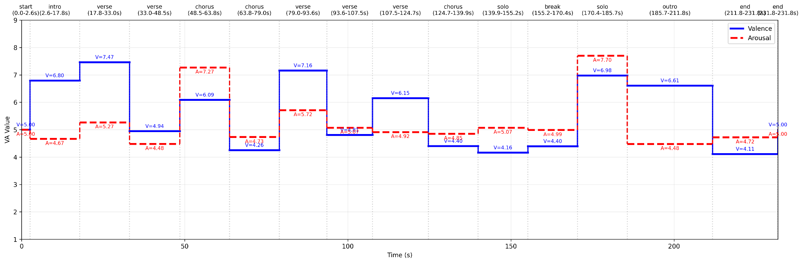

# Dimensional Music Emotion Recognition
## Introduction
<p align="center">
  
</p>  
This repository provides a collection of pipelines for music valence–arousal (VA) estimation and visualization.
The repository currently includes three different inference settings:

1. **Base acoustic model**  
   A lightweight BEATs-based regression framework that predicts VA directly from audio features using a feed-forward regression head. The model performs temporal inference using a 5-second analysis window with a 2.5-second stride.

2. **LLM-refined full-song inference**  
   An extended pipeline that combines acoustic base predictions with audio descriptions and optional lyric transcription, followed by in-context learning (ICL)-based refinement using large language models (LLMs).

3. **Section-level emotion analysis**  
   A structure-aware pipeline that uses allin1 for music segmentation and performs independent VA inference for each section (e.g., intro, verse, chorus). The resulting section-wise predictions can be visualized as temporal emotion trajectories over the course of a song.

- Please see the slide for some examples: [Google Slide](https://docs.google.com/presentation/d/1ElAMaJPgzPhErOd-3w3PMnixizS2TKFIW3IBR_p5FjM/edit?usp=sharing)

## Quick Start Guide
### Installation
Download BEATs feature extractor [pretraind weight](https://drive.google.com/file/d/1FZ8rbTYx_ix2VswOe4nyJC32vzZdmFDT/view?usp=sharing) and place in the [model_state](./model_state/) folder.
This repo is debveloped using python version 3.8
```bash
git clone https://github.com/DCN2001/MusicEmotionModeling.git
cd MusicEmotionModeling
pip install -r requirements.txt
```
* The repository has been tested with PyTorch 2.6 and CUDA 12.x.  
  Depending on your GPU architecture and CUDA version, you may need to install a compatible version of `torch` and `torchaudio`.


### Inference

#### 1. Base acoustic model (5-second temporal inference)

Predict valence and arousal directly from acoustic features using the BEATs-based regression model.

```bash
python infer_base_5s.py --audio_path PATH_TO_AUDIO_FILE
```

This mode performs temporal inference using:
- 5-second analysis windows
- 2.5-second stride

and generates frame-level VA predictions over time.

#### Section-wise VA trajectory Example


---

#### 2. Full-song LLM-refined inference

Perform whole-song VA estimation with LLM-based refinement using:
- acoustic base prediction
- audio description
- optional lyric transcription

```bash
python infer_full.py --audio_path PATH_TO_AUDIO_FILE
```

This mode integrates GPT-based in-context learning (ICL) refinement for improved semantic emotion estimation.

---

#### 3. Section-level emotion analysis

Perform structure-aware section-wise VA inference using allin1 segmentation.

```bash
python infer_section.py --audio_path PATH_TO_AUDIO_FILE
```

This pipeline:
- segments music into structural sections (e.g., intro, verse, chorus)
- predicts VA independently for each section
- visualizes temporal emotion trajectories across the song

#### Section-wise VA trajectory Example


Blue lines indicate valence and red dashed lines indicate arousal across different music sections.