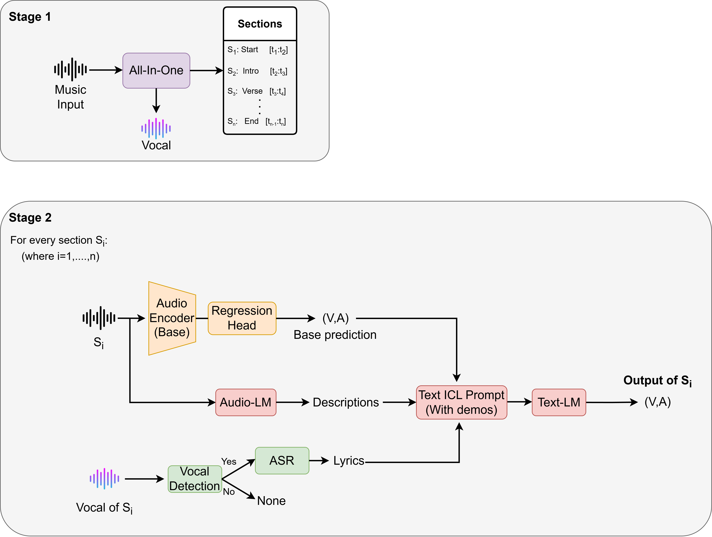
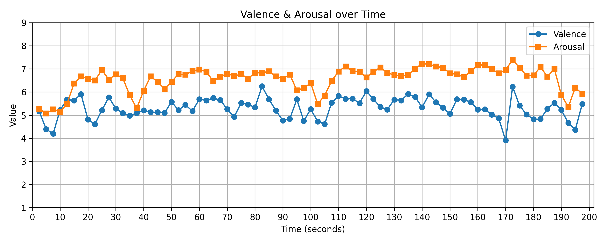
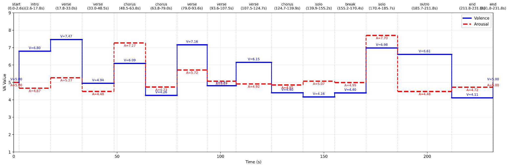
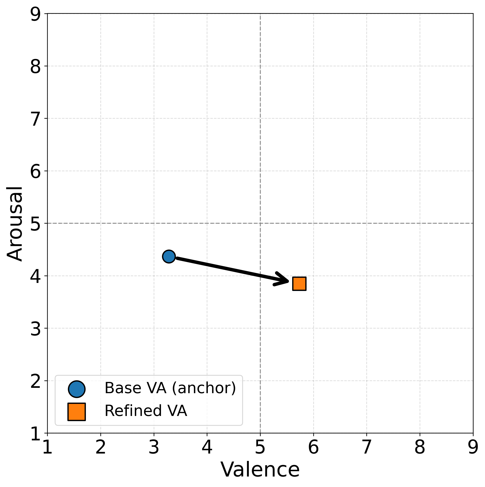
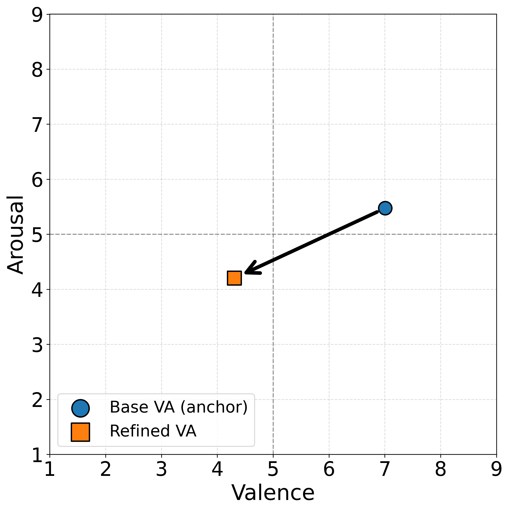
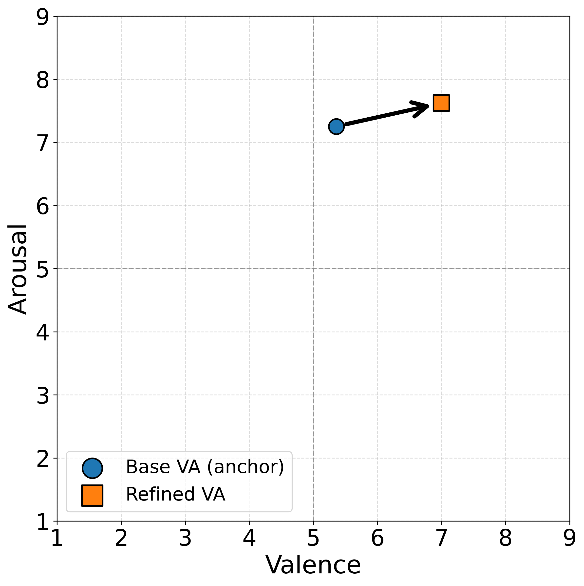
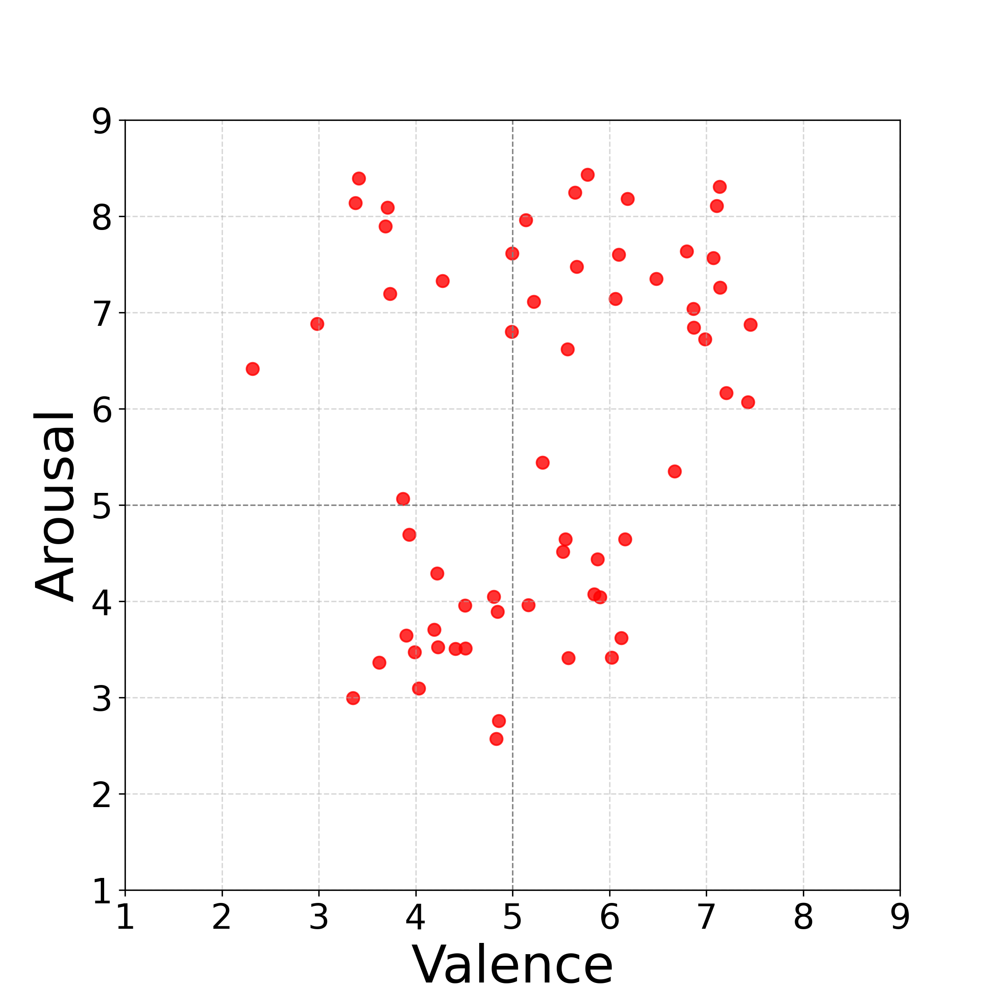
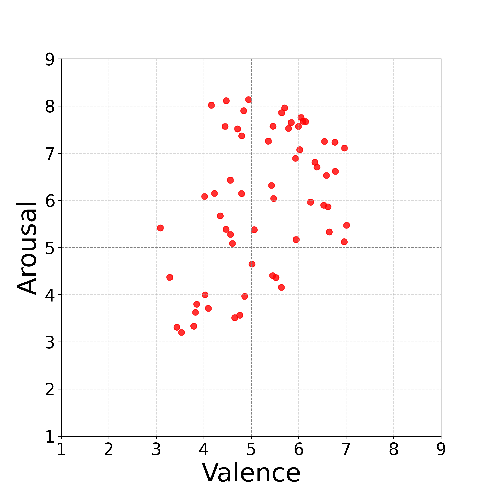
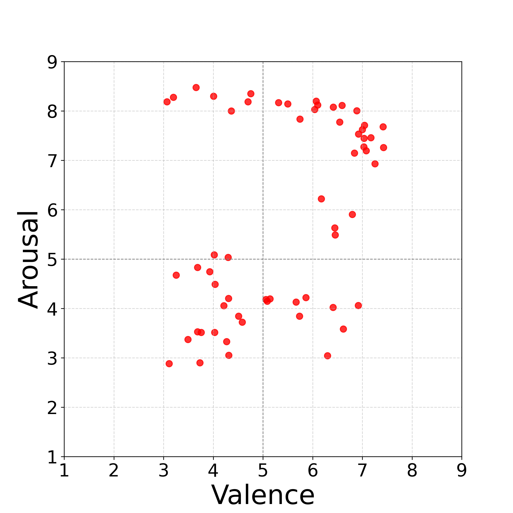

# Dimensional Music Emotion Recognition
## Introduction
<p align="center">
  
</p>  
This repository provides a collection of pipelines for music valence–arousal (VA) estimation and visualization.
The repository currently includes three different inference settings:

1. **Base acoustic model**  
   A lightweight BEATs-based regression framework that predicts VA directly from audio features using a feed-forward regression head. The model performs temporal inference using a 5-second analysis window with a 2.5-second stride.

2. **LLM-refined full-song inference**  
   An extended pipeline that combines acoustic base predictions with audio descriptions and optional lyric transcription, followed by in-context learning (ICL)-based refinement using large language models (LLMs).

3. **Section-level emotion analysis**  
   A structure-aware pipeline that uses allin1 for music segmentation and performs independent VA inference for each section (e.g., intro, verse, chorus). The resulting section-wise predictions can be visualized as temporal emotion trajectories over the course of a song.

- Please see the slide for some examples: [Google Slide](https://docs.google.com/presentation/d/1ElAMaJPgzPhErOd-3w3PMnixizS2TKFIW3IBR_p5FjM/edit?usp=sharing)

## Quick Start Guide
### Installation
Download BEATs feature extractor [pretraind weight](https://drive.google.com/file/d/1FZ8rbTYx_ix2VswOe4nyJC32vzZdmFDT/view?usp=sharing) and place in the [model_state](./model_state/) folder.
This repo is debveloped using python version 3.8
```bash
git clone https://github.com/DCN2001/MusicEmotionModeling.git
cd MusicEmotionModeling
pip install -r requirements.txt
```
* The repository has been tested with PyTorch 2.6 and CUDA 12.x.  
  Depending on your GPU architecture and CUDA version, you may need to install a compatible version of `torch` and `torchaudio`.


### Inference

#### 1. Base acoustic model (5-second temporal inference)

Predict valence and arousal directly from acoustic features using the BEATs-based regression model.

```bash
python infer_base_5s.py --audio_path PATH_TO_AUDIO_FILE
```

This mode performs temporal inference using:
- 5-second analysis windows
- 2.5-second stride

and generates frame-level VA predictions over time.

#### Section-wise VA trajectory Example


---

#### 2. Full-song LLM-refined inference

Perform whole-song VA estimation with LLM-based refinement using:
- acoustic base prediction
- audio description
- optional lyric transcription

```bash
python infer_full.py --audio_path PATH_TO_AUDIO_FILE
```

This mode integrates GPT-based in-context learning (ICL) refinement for improved semantic emotion estimation.

---

#### 3. Section-level emotion analysis

Perform structure-aware section-wise VA inference using allin1 segmentation.

```bash
python infer_section.py --audio_path PATH_TO_AUDIO_FILE
```

This pipeline:
- segments music into structural sections (e.g., intro, verse, chorus)
- predicts VA independently for each section
- visualizes temporal emotion trajectories across the song

#### Section-wise VA trajectory Example


Blue lines indicate valence and red dashed lines indicate arousal across different music sections.

## Supplmentary
### Examples of refinement and reasoning
The following examples illustrate how the LLM refines the base VA predictions. Each figure shows the resulting change in the VA space, followed by the rationale provided by the LLM.
#### Example.1: [Louis Armstrong - What a wonderful world](https://youtu.be/rBrd_3VMC3c?si=JEknikrWfWKlrXgF)
<div align="center">

</div>

Reason given by LLM:
- The lyrics are overtly positive and tender, celebrating beauty and gratitude (“what a wonderful world,” trees of green, skies of blue), which strongly suggests high valence.

- However, the description portrays a slow country ballad with a melancholic, regretful tone, which tempers the positivity. 

- Given these conflicting cues, the prior at 3.27 should be nudged upward to reflect the affirmative lyrical content, but only moderately due to the sad musical delivery.


#### Example.2: [Billie Holiday - Gloomy Sunday](https://youtu.be/XQ2AuLaClmk?si=gUwBc7p8btVi0cg-)
<div align="center">
 
</div>

Reason given by LLM:
- The lyrics depict profound grief and death imagery (“shadows … numberless,” “flowers will never awaken you,” “black coach of sorrow”), strongly signaling very low valence. 

- The description reinforces this with slow tempo, dark minor tonality, and themes of sorrow, loss, and melancholy. 

- Since both sources point to a darker mood than the already-low prior, the valence should be moved further down.

#### Example.3: [Roy Orbison - Pretty Woman](https://youtu.be/3KFvoDDs0XM?si=0cqRLAY9J3Ia4OD1)
<div align="center">
 
</div>

Reason given by LLM:
- The lyrics center on admiration and flirtation toward a “pretty woman,” with lines like “No one could look as good as you,” conveying warmth and positivity. 

- The description reinforces an upbeat, feel-good mood with fast tempo, energetic instrumentation, and happy emotion. 

- The description reinforces an upbeat, feel-good mood with fast tempo, energetic instrumentation, and happy emotion. 

### Data distribution
The figures compare the distributions of Ground Truth, Base Prediction, and ICL Prediction from left to right, illustrating the effect of ICL refinement on the prediction distribution.

<table>
  <tr>
    <td align="center">
      <b>Ground Truth</b><br>
      
    </td>
    <td align="center">
      <b>Base Prediction</b><br>
      
    </td>
    <td align="center">
      <b>ICL Prediction</b><br>
      
    </td>
  </tr>
</table>

### Inference results on external data
The following examples show inference results on songs outside the MER60 dataset. Each song is segmented into sections using All-in-One, with VA predictions generated separately for each section. Thus, the results represent section-wise VA predictions rather than a single VA value for the entire song.
#### Example.1: [Ludwig Göransson - Can You Hear The Music](https://youtu.be/4JZ-o3iAJv4?si=llIG00xTQi8Qd5Pi)
<div align="center">

</div>

#### Example.2: [ZAYN & Sia - Dusk Till Dawn](https://youtu.be/p-eS-_olx9M?si=gh3eETa2iQPuE-Xj)
<div align="center">

</div>

#### Example.3: [JVKE - Golden Hour](https://youtu.be/PEM0Vs8jf1w?si=gwgewAPNbwNMw10J)
<div align="center">

</div>